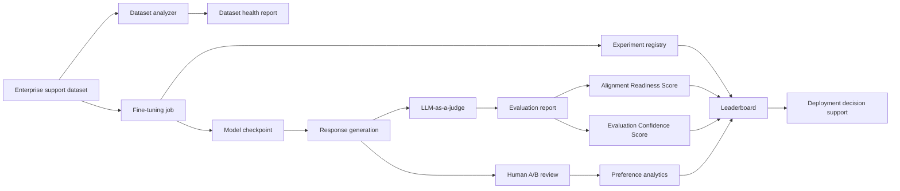

# AlignAI


**AlignAI** is a Generative AI evaluation and enablement platform for adapting,
evaluating, and selecting domain-specific LLMs. It implements the core workflow
behind enterprise AI enablement: dataset readiness, model fine-tuning,
LLM-as-a-judge evaluation, human preference review, alignment scoring,
confidence analysis, cost tracking, and deployment decision support.

Instead of treating fine-tuning as a one-off notebook task, AlignAI turns the
process into a repeatable model-governance workflow. Teams can compare Base,
LoRA, QLoRA, and Full Fine-Tuning variants, score them against a structured
rubric, collect blind A/B human feedback, and export evidence-backed reports
before a model is promoted.

## System Overview

| Area | Implementation |
| --- | --- |
| System purpose | Evaluates and compares fine-tuned LLM variants for staged deployment readiness |
| AI enablement workflow | Dataset analysis, training, generation, judge evaluation, human review, leaderboard, and reports |
| Fine-tuning engine | Hugging Face Transformers, TRL SFTTrainer, PEFT LoRA/QLoRA, full fine-tuning, and hardware-aware loading |
| Evaluation engine | OpenAI LLM-as-a-judge with an 8-category enterprise-support rubric |
| Alignment scoring | 0-100 Alignment Readiness Score weighted across quality, safety, consistency, human preference, and dataset health |
| Decision support | Candidate ranking across judge quality, readiness, confidence, safety, preference, latency, cost, and dataset health |
| User experience | 8-page Streamlit platform covering datasets, experiments, training jobs, evaluations, alignment, leaderboards, human review, and reports |
| Persistence | JSON-backed experiment registry, evaluation reports, dataset health files, preference records, and exportable decision artifacts |
| Delivery | Dockerfile, Makefile, GitHub Actions CI, pytest coverage, ruff linting, and reproducible CLI entrypoints |

## LLM Evaluation Design

AlignAI implements the main layers of a production-minded LLM evaluation system:

| Layer | Implementation |
| --- | --- |
| Dataset readiness | JSONL conversation analysis with role balance, duplicate detection, token estimates, and health scoring |
| Model adaptation | Strategy-specific training for Base, LoRA, QLoRA, and Full Fine-Tuning model variants |
| Generation metrics | Evaluation responses include latency, input tokens, output tokens, total tokens, and tokens per second |
| Automated judging | OpenAI judge model scores correctness, relevance, helpfulness, instruction following, safety, consistency, conciseness, and tone |
| Human preference | Blind pairwise A/B review with win-rate analytics and head-to-head comparison support |
| Readiness scoring | Composite deployment-readiness signal normalized to 0-100 |
| Confidence analysis | Heuristic confidence score based on sample coverage, judge variance, human agreement, category coverage, and contradictions |
| Cost awareness | Training duration and GPU cost estimates tracked in experiment metadata |
| Decision export | JSON reports combine judge scores, readiness, confidence, candidate rankings, evidence, tradeoffs, and deployment gates |

## Measured Results

Current verification from this codebase:

| Check | Result |
| --- | --- |
| Test suite | 30 passed pytest tests |
| Dependency consistency | `python -m pip check` reports no broken requirements |
| Streamlit workflow | 8 application pages for the full AI enablement lifecycle |
| Fine-tuning strategies | 3 supported strategies: Full Fine-Tuning, LoRA, and QLoRA |
| Evaluation rubric | 8 judge categories with score and justification fields |
| Deployment metrics | 9 tracked candidate signals: quality, readiness, confidence, safety, preference, latency, training cost, inference cost, and dataset health |
| Sample data | 12 enterprise-support conversations for local pipeline validation |
| Artifact model | JSON outputs for experiments, evaluations, reports, preferences, dataset health, and deployment decisions |
| CI workflow | GitHub Actions installs dependencies, runs ruff, runs pytest with coverage, and smoke-tests core imports |

## Architecture



Runtime flow:

1. Training data is analyzed for dataset health and quality risks.
2. A candidate model is trained through Full Fine-Tuning, LoRA, or QLoRA.
3. Experiment metadata captures strategy, model version, hyperparameters,
   duration, output path, and cost estimate.
4. The candidate model generates evaluation responses with latency and token
   metrics.
5. The LLM judge scores responses using the structured enterprise-support
   rubric.
6. Human reviewers provide blind A/B preference feedback.
7. Alignment and confidence engines convert evidence into deployment-readiness
   signals.
8. Leaderboards and reports rank candidates and export decision artifacts.

More system-design detail is available in [docs/architecture.md](docs/architecture.md).

## Core Features

| Capability | Implementation |
| --- | --- |
| Dataset Management | Upload, inspect, analyze, and persist health reports for JSONL conversation data |
| Experiment Tracking | JSON registry for model version, dataset version, strategy, hyperparameters, duration, cost, status, and evaluation scores |
| Fine-Tuning Jobs | Configurable Full Fine-Tuning, LoRA, and QLoRA jobs using TRL SFTTrainer |
| Model Loading | Base, full checkpoint, LoRA adapter, and QLoRA adapter loading utilities |
| Response Generation | Chat-template generation with latency and token-throughput metrics |
| LLM-as-a-Judge | OpenAI-backed evaluator with structured JSON output and retry handling |
| Alignment Dashboard | Readiness score, score breakdown, confidence evidence, and improvement actions |
| Human Review Center | Pairwise comparison preparation, preference collection, ties/skips, and analytics |
| Leaderboards | Model comparison by quality, alignment, safety, cost, latency, preference, and confidence |
| Reports | Exportable JSON reports with category breakdowns, judge reasoning samples, examples, readiness, confidence, and deployment decision data |
| Deployment Decision Engine | Weighted candidate ranking with supporting evidence, tradeoffs, alternative fit, and rollout gates |
| CI Validation | Offline test suite, linting, coverage reporting, and import smoke tests |

## Tech Stack

| Layer | Tools |
| --- | --- |
| Language | Python 3.11+ |
| ML framework | PyTorch |
| LLM tooling | Hugging Face Transformers, Datasets, Accelerate |
| Fine-tuning | PEFT, LoRA, QLoRA, TRL SFTTrainer, bitsandbytes |
| Evaluation | OpenAI SDK and structured LLM-as-a-judge prompts |
| UI | Streamlit multipage application |
| Data and visualization | Pandas, NumPy, Matplotlib, Seaborn |
| Configuration | python-dotenv and environment-backed settings |
| Testing | pytest, pytest-cov, ruff |
| Delivery | Docker, Makefile, GitHub Actions |

## Repository Structure

```text
alignai/
|-- app/                   # Streamlit AI enablement platform
|   |-- Home.py
|   `-- pages/             # Dataset, experiment, training, evaluation, alignment, leaderboard, review, and report pages
|-- data/
|   |-- samples/           # Enterprise-support sample dataset
|   `-- artifacts/         # Generated JSON outputs kept out of source control
|-- docs/                  # Architecture, deployment, evaluation, alignment, and decision-engine docs
|-- notebooks/             # Fine-tuning and evaluation pipeline notebooks
|-- scripts/               # CLI entrypoints for analysis, training, and evaluation
|-- src/alignai/           # Core package
|   |-- alignment/         # Readiness scoring and normalized deployment signals
|   |-- datasets_analysis/ # Dataset health analysis
|   |-- evaluation/        # Judge prompts, scoring, confidence, metrics, and reports
|   |-- experiments/       # Registry, leaderboard, and deployment decision ranking
|   |-- models/            # Model loading and response generation
|   |-- preference/        # Human review and preference analytics
|   `-- training/          # Data formatting, strategy configs, and trainer orchestration
|-- tests/                 # Offline pytest suite
|-- .github/workflows/     # CI verification
|-- Dockerfile
|-- Makefile
|-- pyproject.toml
|-- requirements.txt
|-- requirements-dev.txt
`-- README.md
```

## Quick Start

```bash
python -m venv .venv
source .venv/bin/activate
python -m pip install --upgrade pip
python -m pip install -r requirements-dev.txt
python -m pip install -e .
cp .env.example .env
```

Add your OpenAI key to `.env` for judge-based evaluation:

```text
OPENAI_API_KEY=sk-your-openai-key-here
```

Run the Streamlit platform:

```bash
streamlit run app/Home.py
```

Open:

```text
http://localhost:8501
```

## Core Commands

Analyze the sample enterprise-support dataset:

```bash
python scripts/analyze_dataset.py --dataset data/samples/enterprise_support_dataset.jsonl
```

Run a LoRA fine-tuning job:

```bash
python scripts/run_finetune.py \
  --strategy lora \
  --dataset data/samples/enterprise_support_dataset.jsonl \
  --epochs 3
```

Evaluate the latest experiment:

```bash
python scripts/run_evaluation.py --experiment-id latest
```

Run offline validation:

```bash
python scripts/run_evaluation.py --experiment-id latest --mock
python -m pytest tests -q
python -m pip check
```

## Environment Configuration

| Variable | Required | Purpose |
| --- | --- | --- |
| `OPENAI_API_KEY` | Judge evaluation | OpenAI key for LLM-as-a-judge scoring |
| `OPENAI_JUDGE_MODEL` | Optional | Judge model, default `gpt-4o-mini` |
| `HF_TOKEN` | Optional | Private Hugging Face model access |
| `ALIGNAI_BASE_MODEL_LORA` | Optional | Base model for LoRA and QLoRA |
| `ALIGNAI_BASE_MODEL_FFT` | Optional | Base model for full fine-tuning |
| `ALIGNAI_GPU_HOUR_COST` | Optional | GPU cost rate for training estimates |
| `ALIGNAI_SEED` | Optional | Reproducibility seed |
| `ALIGNAI_ARTIFACTS_DIR` | Optional | JSON artifact output directory |
| `ALIGNAI_CHECKPOINTS_DIR` | Optional | Model checkpoint output directory |

## Docker

```bash
docker build -t alignai .
docker run -p 8501:8501 \
  -e OPENAI_API_KEY=your_key \
  -v $(pwd)/data:/app/data \
  alignai
```

## Documentation

- [Architecture](docs/architecture.md)
- [Deployment Guide](docs/deployment.md)
- [Evaluation Methodology](docs/evaluation_methodology.md)
- [Alignment Score](docs/alignment_score.md)
- [Deployment Decision Engine](docs/recommendation_engine.md)

## Operational Notes

- LLM-as-a-judge evaluation uses OpenAI API calls and model usage cost.
- Full Fine-Tuning and QLoRA are GPU-oriented workloads; QLoRA requires NVIDIA-compatible quantization support.
- Evaluation confidence is a heuristic explainability signal, not a statistical probability.
- Runtime artifacts are JSON files under `data/artifacts/` and are ignored by source control except for `.gitkeep`.
- Model checkpoints and local virtual environments are intentionally excluded from the repository.

## License

Apache-2.0
