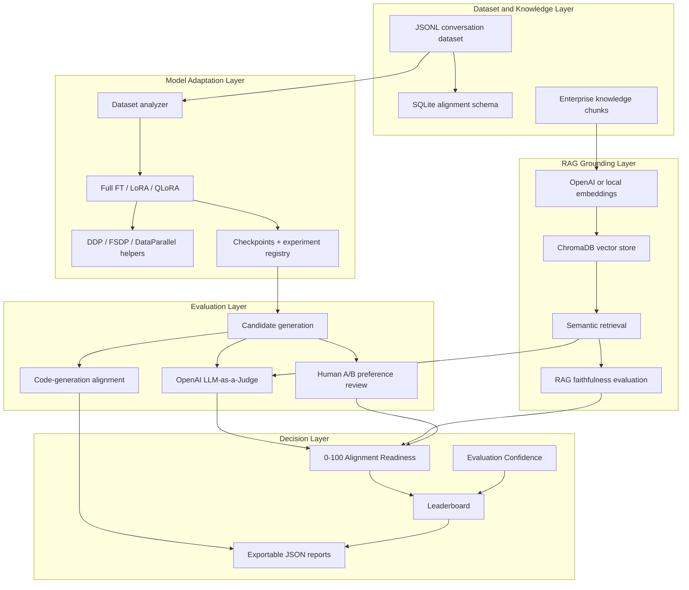

# AlignAI


**AlignAI** is a Generative AI evaluation and enablement platform for adapting,
grounding, evaluating, and selecting domain-specific LLMs before deployment.

It combines **fine-tuning**, **RAG grounding**, **LLM-as-a-judge evaluation**,
**code-generation assessment**, **human preference review**, **alignment
readiness scoring**, **distributed training hooks**, **SQL dataset management**,
and **deployment decision support** in one reproducible workflow.

## Table of Contents

- [Why AlignAI](#why-alignai)
- [At a Glance](#at-a-glance)
- [What It Evaluates](#what-it-evaluates)
- [Architecture](#architecture)
- [Quick Start](#quick-start)
- [Core Workflows](#core-workflows)
- [Python Examples](#python-examples)
- [Capability Matrix](#capability-matrix)
- [Tech Stack](#tech-stack)
- [Repository Structure](#repository-structure)
- [Validation](#validation)
- [Documentation](#documentation)

## Why AlignAI

Fine-tuning a model is only one part of enterprise AI adoption. Teams also need
to answer harder release questions:

- Is the tuned model actually better than the base model?
- Is the answer grounded in retrieved enterprise context?
- Is the model safe, consistent, and instruction-following enough to ship?
- Does human preference agree with automated judge scores?
- Which candidate has the best tradeoff across quality, safety, cost, latency,
  confidence, and dataset health?

AlignAI turns those questions into a measurable model-governance workflow. It
compares **Base**, **Full Fine-Tuning**, **LoRA**, and **QLoRA** variants,
scores outputs with structured rubrics, evaluates retrieved-context
faithfulness, analyzes generated code, captures blind A/B feedback, and exports
decision-ready reports.

## At a Glance

| Area | Implementation |
| --- | --- |
| System purpose | Select deployment-ready LLM variants using measurable quality, safety, grounding, preference, and cost signals |
| Fine-tuning | Full Fine-Tuning, LoRA, and QLoRA with Hugging Face Transformers, TRL, PEFT, and bitsandbytes |
| Distributed training | PyTorch DDP setup, FSDP wrapping, DataParallel fallback, and distributed SFT configuration helpers |
| RAG grounding | ChromaDB vector retrieval, OpenAI/local embeddings, semantic search, prompt augmentation, faithfulness scoring |
| LLM evaluation | OpenAI LLM-as-a-judge across 8 enterprise-support rubric categories |
| Code alignment | Programming LLM quality checks for functional correctness, security, readability, and efficiency |
| Human review | Blind pairwise A/B response comparison with win-rate analytics |
| Decision support | 9 deployment signals across quality, readiness, confidence, safety, preference, latency, cost, and dataset health |
| UI | 8-page Streamlit platform for dataset, training, evaluation, alignment, leaderboard, review, and reports |
| Data layer | JSON artifact store plus SQLite schema and SQL notebook for dataset/evaluation analysis |
| Validation | 40 pytest tests, ruff linting, Dockerfile, Makefile, and GitHub Actions workflow |

## What It Evaluates

| Evaluation Surface | Signals Produced |
| --- | --- |
| Dataset readiness | Role balance, duplicates, token estimates, conversation length, quality issues, health score |
| Fine-tuned text models | Judge score, category breakdowns, alignment readiness, confidence, latency, token metrics |
| RAG responses | Retrieval relevance, response faithfulness, groundedness, unsupported terms, context count |
| Code-generation models | Functional correctness, security, readability, efficiency, overall code-quality score |
| Human preference | Pairwise win rates, ties, skips, and head-to-head model preference analytics |
| Deployment candidates | Ranked candidate table with supporting evidence, tradeoffs, warnings, and alternatives |

## Architecture



## Quick Start

```bash
python -m venv .venv
source .venv/bin/activate
python -m pip install --upgrade pip
python -m pip install -r requirements-dev.txt
python -m pip install -e .
cp .env.example .env
```

Set an OpenAI key for judge-based evaluation and production embeddings:

```text
OPENAI_API_KEY=sk-your-openai-key-here
```

Run the platform:

```bash
streamlit run app/Home.py
```

Open:

```text
http://localhost:8501
```

## Core Workflows

Analyze the sample enterprise-support dataset:

```bash
python scripts/analyze_dataset.py --dataset data/samples/enterprise_support_dataset.jsonl
```

Run a LoRA fine-tuning job:

```bash
python scripts/run_finetune.py \
  --strategy lora \
  --dataset data/samples/enterprise_support_dataset.jsonl \
  --epochs 3
```

Evaluate the latest experiment:

```bash
python scripts/run_evaluation.py --experiment-id latest
```

Run offline validation:

```bash
python scripts/run_evaluation.py --experiment-id latest --mock
python -m pytest tests -q
python -m ruff check src tests scripts app
python -m pip check
```

Explore the SQL dataset model:

```bash
jupyter notebook notebooks/sql_analysis.ipynb
```

## Python Examples

### RAG-Grounded Evaluation

```python
from alignai.rag import (
    ChromaContextRetriever,
    RetrievalDocument,
    build_rag_augmented_judge_messages,
    evaluate_rag_context,
)

retriever = ChromaContextRetriever(collection_name="alignai_demo")
retriever.add_documents([
    RetrievalDocument(
        document_id="policy-1",
        text="Enterprise password resets require MFA verification.",
        metadata={"source": "security_policy.md"},
    )
])

context = retriever.retrieve("How should password resets be handled?", top_k=1)
messages = build_rag_augmented_judge_messages(
    user_prompt="How should password resets be handled?",
    assistant_response="Password resets require MFA verification.",
    retrieved_context=context,
)
rag_scores = evaluate_rag_context(
    "How should password resets be handled?",
    "Password resets require MFA verification.",
    context,
)
```

### Code-Generation Alignment

```python
from alignai.experiments.code_alignment import evaluate_code_quality

report = evaluate_code_quality(
    "def add(a, b):\n    return a + b\n",
    language="python",
)

print(report.to_dict())
```

### Distributed Training Configuration

```python
from alignai.training import DistributedTrainingConfig, distributed_training_kwargs

cfg = DistributedTrainingConfig(strategy="ddp", world_size=4, local_rank=0)
trainer_kwargs = distributed_training_kwargs(cfg)
```

For multi-process launches:

```bash
torchrun --nproc_per_node=4 scripts/run_finetune.py \
  --strategy lora \
  --dataset data/samples/enterprise_support_dataset.jsonl
```

## Capability Matrix

| Capability | Implementation |
| --- | --- |
| Dataset management | JSONL upload, role distribution, duplicate detection, token estimates, health reports |
| SQL analysis | SQLite schema for datasets, conversations, messages, model variants, evaluation runs, judge scores, and human preferences |
| Fine-tuning | Full Fine-Tuning, LoRA, QLoRA, TRL SFTTrainer, PEFT configs, checkpoint persistence |
| Distributed compute | `torch.distributed.init_process_group`, DDP, FSDP, DataParallel fallback, training kwargs |
| Generation | Chat-template generation with latency, input tokens, output tokens, total tokens, and tokens/sec |
| RAG retrieval | ChromaDB vector store, OpenAI embeddings, local hash embeddings, metadata filters, semantic search |
| RAG evaluation | Relevance, faithfulness, groundedness, unsupported terms, retrieved-context prompt injection |
| LLM-as-a-judge | OpenAI judge model, 8 rubric categories, JSON response format, retry handling |
| Code alignment | YAML rubric and heuristic scoring for correctness, security, readability, and efficiency |
| Human preference | Blind A/B comparison, win-rate analytics, ties, skips, head-to-head summaries |
| Readiness scoring | 0-100 Alignment Readiness across quality, preference, safety, consistency, dataset health, instruction following, and conciseness |
| Confidence scoring | Sample coverage, judge variance, human agreement, category coverage, contradiction detection |
| Decision support | Candidate ranking across 9 deployment signals with evidence, tradeoffs, warnings, and JSON export |
| Delivery | Streamlit UI, Dockerfile, Makefile, GitHub Actions, pytest, ruff, package metadata |

## Tech Stack

| Layer | Tools |
| --- | --- |
| Language | Python 3.11+ |
| ML framework | PyTorch |
| LLM tooling | Hugging Face Transformers, Datasets, Accelerate |
| Fine-tuning | PEFT, LoRA, QLoRA, TRL SFTTrainer, bitsandbytes |
| Distributed training | PyTorch DDP, FSDP, DataParallel |
| Retrieval | ChromaDB, OpenAI embeddings, semantic search |
| Evaluation | OpenAI SDK, LLM-as-a-judge prompts, RAG faithfulness scoring |
| Code evaluation | YAML rubric and programming-LLM quality heuristics |
| UI | Streamlit multipage application |
| Data | SQL, SQLite, JSONL, Pandas, NumPy |
| Visualization | Matplotlib, Seaborn, Streamlit charts |
| Delivery | Docker, Makefile, GitHub Actions |

## Repository Structure

```text
alignai/
|-- app/                    # Streamlit AI enablement platform
|   |-- Home.py
|   `-- pages/              # Dataset, experiment, training, evaluation, alignment, leaderboard, review, reports
|-- data/
|   |-- alignment_dataset.sql
|   |-- samples/            # Enterprise-support sample dataset
|   `-- artifacts/          # Generated JSON outputs kept out of source control
|-- docs/                   # Architecture, deployment, evaluation, alignment, decision-engine docs
|-- notebooks/
|   |-- 01_finetuning_pipeline.ipynb
|   |-- 02_evaluation_pipeline.ipynb
|   `-- sql_analysis.ipynb
|-- scripts/                # CLI entrypoints for analysis, training, and evaluation
|-- src/alignai/
|   |-- alignment/          # Readiness scoring
|   |-- datasets_analysis/  # Dataset health analysis
|   |-- evaluation/         # Judge prompts, metrics, reports, confidence
|   |-- experiments/        # Registry, leaderboard, deployment decision, code alignment
|   |-- models/             # Model loading and response generation
|   |-- preference/         # Human review analytics
|   |-- rag/                # ChromaDB retrieval, prompt augmentation, RAG scoring
|   `-- training/           # Training strategies, trainer, distributed fine-tuning helpers
|-- tests/                  # 40-test offline suite
|-- Dockerfile
|-- Makefile
|-- pyproject.toml
|-- requirements.txt
|-- requirements-dev.txt
`-- README.md
```

## Validation

Current local verification:

| Check | Result |
| --- | --- |
| Unit tests | 40 passed |
| Linting | `ruff check src tests scripts app` passed |
| Syntax validation | `compileall` passed |
| Dependency sanity | `python -m pip check` reports no broken requirements |
| Public repo hygiene | Generated caches, virtual environments, checkpoints, and runtime artifacts excluded |

Test coverage spans core scoring, dataset analysis, experiment registry,
deployment ranking, human preference analytics, RAG grounding, distributed
training configuration, code-generation alignment, and report generation.

## Environment Configuration

| Variable | Required | Purpose |
| --- | --- | --- |
| `OPENAI_API_KEY` | Judge evaluation and production embeddings | OpenAI key for LLM-as-a-judge and embedding retrieval |
| `OPENAI_JUDGE_MODEL` | Optional | Judge model, default `gpt-4o-mini` |
| `HF_TOKEN` | Optional | Private Hugging Face model access |
| `ALIGNAI_BASE_MODEL_LORA` | Optional | Base model for LoRA and QLoRA |
| `ALIGNAI_BASE_MODEL_FFT` | Optional | Base model for full fine-tuning |
| `ALIGNAI_GPU_HOUR_COST` | Optional | GPU cost rate for training estimates |
| `ALIGNAI_SEED` | Optional | Reproducibility seed |
| `ALIGNAI_ARTIFACTS_DIR` | Optional | JSON artifact output directory |
| `ALIGNAI_CHECKPOINTS_DIR` | Optional | Model checkpoint output directory |

## Docker

```bash
docker build -t alignai .
docker run -p 8501:8501 \
  -e OPENAI_API_KEY=your_key \
  -v $(pwd)/data:/app/data \
  alignai
```

## Documentation

- [Architecture](docs/architecture.md)
- [Deployment Guide](docs/deployment.md)
- [Evaluation Methodology](docs/evaluation_methodology.md)
- [Alignment Score](docs/alignment_score.md)
- [Deployment Decision Engine](docs/recommendation_engine.md)

## License

Apache-2.0
